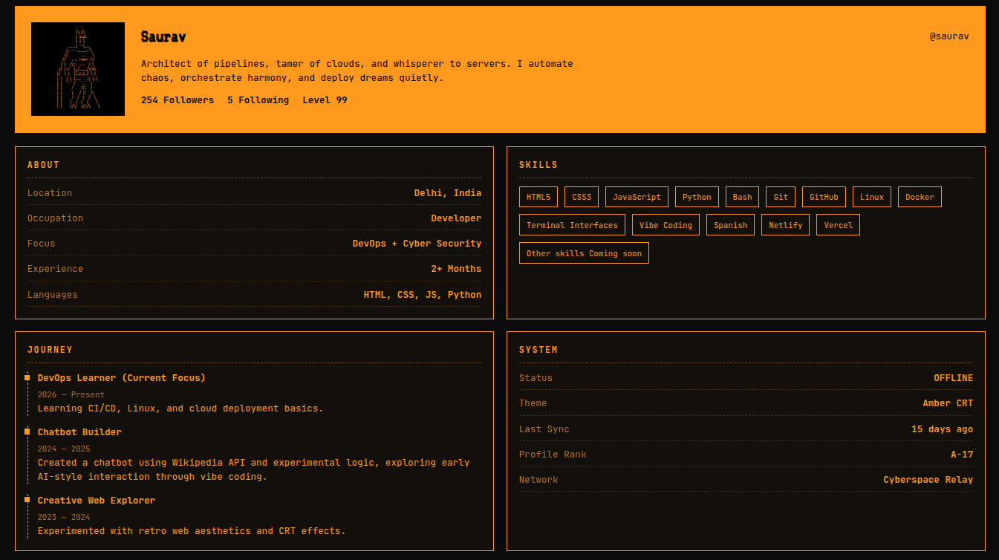

# 🖥️ saurav-profile

A retro terminal-style personal developer portfolio built using **HTML and CSS**, showcasing skills, journey, and DevOps-inspired UI aesthetics.

---

## 🌐 Live Repository
👉 https://github.com/onerauv/saurav-profile

---

## 📸 Preview

---

## ⚡ Features
- Terminal-style UI design
- Retro cyber aesthetic theme
- Developer profile layout
- Skills showcase section
- Journey timeline
- Fully responsive design

---

## 🛠️ Tech Stack
- HTML5
- CSS3
- Google Fonts
- Flexbox & Grid

---

## 📁 Project Structure